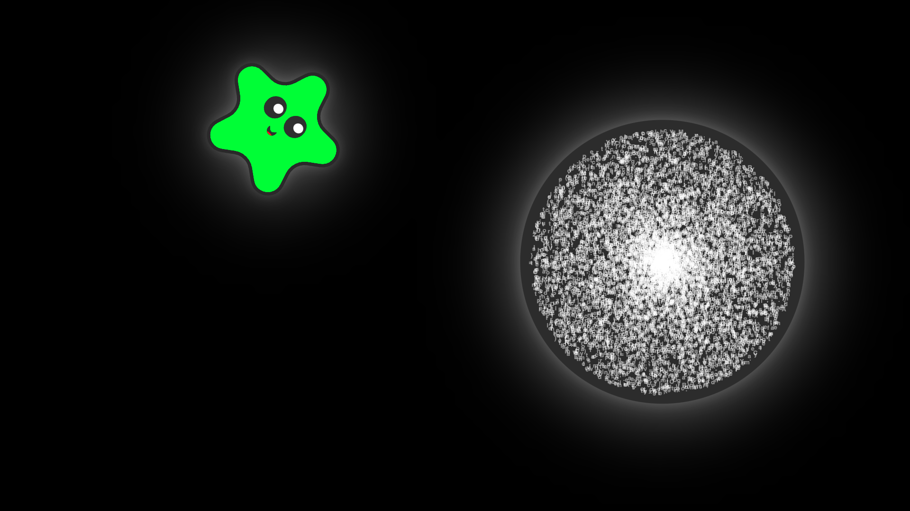

# Clipboard Eater

## Overview

What is Clipboard Eater? Well... it eats your clipboard. Rather than explaining, it's easiest to [try it yourself](https://techpandapro.github.io/clipboard-eater/)!

You'll need to allow the page to access your clipboard. Once you do, try copying text from another window. When moving back to Clipboard Eater, you should see a "bubble" appear. Once you paste it (`Ctrl/Cmd + V`), the "pet" will eat all the text!

As you feed text to your pet, it grows and changes shape/color.

## Why?

This project, of course, serves no practical purpose. It's just supposed to be a goofy and fun website. :)

For context, this project was inspired by the idea machine on the homepage of [Hack Club Arcade](https://hackclub.com/arcade/). The prompt was to "make a random virtual pet that changes colors and shapes every time you feed it." Obviously feeding the pet your clipboard was the only option!
